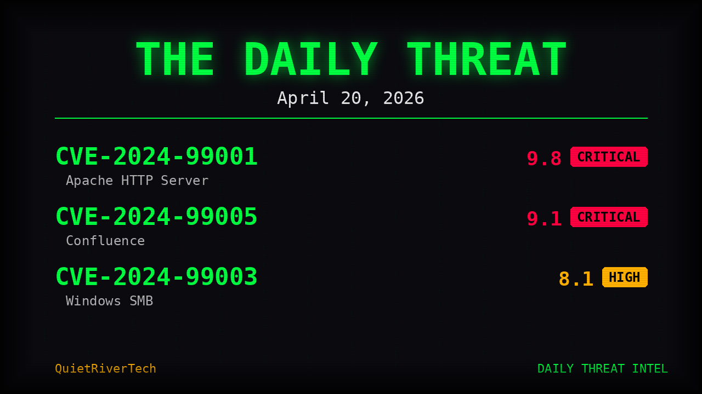

# 🎙️ The Daily Threat

**AI-generated noir cybersecurity podcast — a hard-boiled detective investigates today's CVEs**

Every day, Jack Cipher hits the streets to investigate the latest CVEs, KEV additions, and EPSS scores. Written by AI, narrated by Jelf (ElevenLabs), delivered to your Telegram.



---

## How It Works

1. **Fetches latest CVEs** from Shodan CVEDB
2. **AI writes noir detective script** — hard-boiled narration of the day's vulnerabilities
3. **ElevenLabs generates voice narration** — voiced by Jelf
4. **Delivered as voice memo** — straight to your Telegram

## Quick Start

```bash
git clone https://github.com/QuietRiverTech/daily-threat.git
cd daily-threat
cp .env.example .env
# Set your API keys in .env
python daily_threat.py
```

## Configuration

| Variable | Description |
|----------|-------------|
| `OPENROUTER_API_KEY` | API key for OpenRouter (script generation) |
| `ELEVENLABS_API_KEY` | API key for ElevenLabs (voice narration) |

## Cron Setup

Schedule daily delivery with cron:

```bash
# Run every day at 7:00 AM
0 7 * * * cd /path/to/daily-threat && python daily_threat.py
```

## Sample Episode

> *The rain hit my terminal like a DDoS on a Monday. I pulled up the feeds — three new CVEs, each uglier than the last.*
>
> *"CVE-2026-1847," I muttered, lighting a cigarette I don't smoke. Remote code execution in a library nobody audits but everybody uses. EPSS score: 0.89. This one had legs.*
>
> *CISA had already slapped it on the KEV list. That meant one thing — somewhere out there, someone wasn't just theorizing. They were exploiting.*

## Part of the Creative Suite

Project 3 of 5

## License

MIT — see [LICENSE](LICENSE)

---

*Built by QuietRiverTech*
